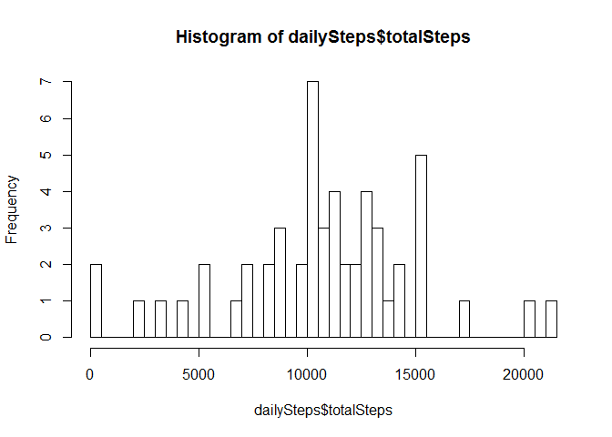
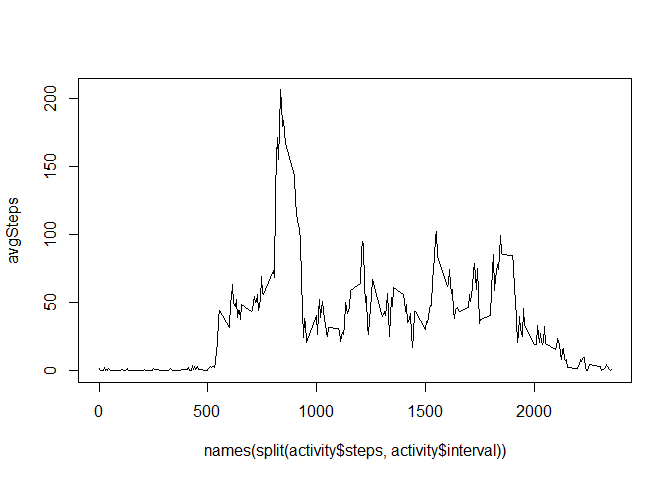
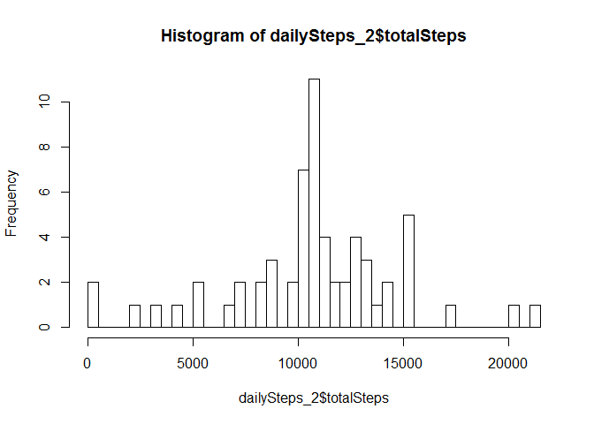
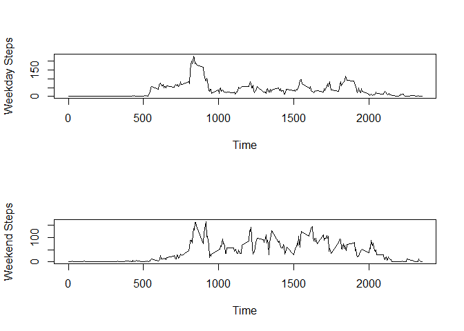

# Reproducible Research: Peer Assessment 1


## Loading and preprocessing the data

The first step in this project is to load the file ```activity.csv``` to the R environment. We use ```read.csv()``` function in R to do this.


```r
activity <- read.csv("activity.csv")
```

This will load a data frame with 17,568 observations and 3 variables (steps, date, and interval). There a quite a number of missing value. Therefore, for our convenience, we shall remove the rows with missing values.


```r
activityCleaned <- activity[!is.na(activity$steps),]
```

The cleaned data frame has 15,264 observations.

## What is mean total number of steps taken per day?

In order to calculate this, we need to first of all calculate the total number of steps taken per day with the help of ```lapply()``` function. The next step to plot the histogram of the daily steps.


```r
dailySteps <- simplify2array(lapply(split(activityCleaned$steps, activityCleaned$date), sum))
dailySteps <- data.frame(date = unique(activity$date), totalSteps = dailySteps)
dailySteps <- dailySteps[dailySteps$totalSteps > 0,]
hist(dailySteps$totalSteps, breaks = 50)
```

 

We can see that there are a couple of outliers in the data and the mean is approximately 10,000. We will justify this with R functions ```mean()``` and ```median()```.


```r
mean(dailySteps$totalSteps)
```

```
## [1] 10766.19
```

```r
median(dailySteps$totalSteps)
```

```
## [1] 10765
```
We can see that the numbers are fairly close to 10,000, which is consistent with what we see graphically.

## What is the average daily activity pattern?

In this section, we want to compute, for each time interval, the average number of steps walked. To do this, we use the following R code.


```r
avgSteps <- simplify2array(lapply(split(activity$steps, activity$interval), mean, na.rm = TRUE))
plot(names(split(activity$steps, activity$interval)), avgSteps, type = "l")
```

 

Among all these time intervals, the maximum average steps can be found as follows.


```r
which.max(avgSteps)
```

```
## 835 
## 104
```

```r
max(avgSteps)
```

```
## [1] 206.1698
```

It happens at 5-minute interval starting at 8:35 A.M. with an average of 206.1698 steps.

## Imputing missing values

As discussed earlier, there exists missing values in the data set for this project. We will first calculate the number of missing values in our data.


```r
sum(is.na(activity$steps))
```

```
## [1] 2304
```

We will now replace these missing values with the average steps over different time interval that we calculated earlier (rounded above).


```r
for (i in 1:nrow(activity)) {
  if(is.na(activity$steps[i])) {
    activity$steps[i] <- ceiling(avgSteps[[as.character(activity$interval[i])]])
  }
}
```

Now, we shall repeat what we did before, which is calculating the total steps walked per day.


```r
dailySteps_2 <- simplify2array(lapply(split(activity$steps, activity$date), sum))
dailySteps_2 <- data.frame(date = unique(activity$date), totalSteps = dailySteps_2)
hist(dailySteps_2$totalSteps, breaks = 50)
```

 

```r
mean(dailySteps_2$totalSteps)
```

```
## [1] 10784.92
```

```r
median(dailySteps_2$totalSteps)
```

```
## [1] 10909
```

We can see that the mean only differs slightly from the previous one and the median shifted by about 150 steps. Imputing the missing value makes the data and calculations more realistic.

## Are there differences in activity patterns between weekdays and weekends?

We will begin by creating a new column indicating whether it is a weekday or a weekend.


```r
activity$date <- as.Date(activity$date, "%Y-%m-%d")
activity$day <- weekdays(activity$date)
activity$category <- NA
for (i in 1:nrow(activity)) {
  if (activity$day[i] %in% c("Saturday", "Sunday")) {
    activity$category[i] = "weekend"
  } else {
    activity$category[i] = "weekday"
  }
}
activity$category <- as.factor(activity$category)
```
The next step is to split the data according to whether it is a weekday or a weekend data, and calculate the respective interval averages.


```r
activityWeekday <- activity[activity$category == "weekday",]
activityWeekend <- activity[activity$category == "weekend",]

avgWeekday <- simplify2array(lapply(split(activityWeekday$steps, activityWeekday$interval), mean, na.rm = TRUE))
avgWeekday <- data.frame(interval = names(avgWeekday), averageStep = avgWeekday)
avgWeekday$interval <- as.numeric(as.character(avgWeekday$interval))

avgWeekend <- simplify2array(lapply(split(activityWeekend$steps, activityWeekend$interval), mean, na.rm = TRUE))
avgWeekend <- data.frame(interval = names(avgWeekend), averageStep = avgWeekend)
avgWeekend$interval <- as.numeric(as.character(avgWeekend$interval))
```

Finally, we do the plotting with the standard R plotting library.

```r
par(mfrow = c(2,1))
plot(avgWeekday$interval, avgWeekday$averageStep, type = "l", xlab = "Time", ylab = "Weekday Steps")
plot(avgWeekend$interval, avgWeekend$averageStep, type = "l", xlab = "Time", ylab = "Weekend Steps")
```

 
